<picture>
  <source media="(prefers-color-scheme: dark) and (max-width: 600px)" srcset="assets/hero-dark-compact.svg">
  <source media="(prefers-color-scheme: light) and (max-width: 600px)" srcset="assets/hero-light-compact.svg">
  <source media="(prefers-color-scheme: dark)" srcset="assets/hero-dark.svg">
  
</picture>

Researcher, AI Engineer & Full-Stack Developer leveraging deep learning to solve complex problems in computer vision and biometrics. Outside of research, I run Dynamis Group, a Melbourne firm that provides digital infrastructure software people rely on.

<!-- LINKS:START -->
<a href="https://www.linkedin.com/in/lukegcollins/"><picture><source media="(prefers-color-scheme: dark)" srcset="assets/links/linkedin-dark.svg"></picture></a>
<a href="mailto:luke.collins@research.deakin.edu.au"><picture><source media="(prefers-color-scheme: dark)" srcset="assets/links/email-dark.svg"></picture></a>
<a href="https://orcid.org/0009-0002-7771-1081"><picture><source media="(prefers-color-scheme: dark)" srcset="assets/links/orcid-dark.svg"></picture></a>
<a href="https://scholar.google.com/citations?user=KIZQVFAAAAAJ&amp;hl=en"><picture><source media="(prefers-color-scheme: dark)" srcset="assets/links/scholar-dark.svg"></picture></a>
<a href="https://dynamisgroup.com.au/"><picture><source media="(prefers-color-scheme: dark)" srcset="assets/links/dynamis-dark.svg"></picture></a>
<!-- LINKS:END -->

## Research

My thesis looks at spatio-temporal deep learning: models that read how a face moves across frames, not only how a single frame looks. Generalisation is the hard part. A detector that aces the manipulations it trained on can fall apart on the next one, so much of my time goes into evaluation that's honest about that.

<!-- PUBLICATIONS:START -->
See [ORCID](https://orcid.org/0009-0002-7771-1081) and [Google Scholar](https://scholar.google.com/citations?user=KIZQVFAAAAAJ&hl=en).
<!-- PUBLICATIONS:END -->

## Featured work

<!-- FEATURES:START -->
<a href="https://github.com/dfwb-research"><picture><source media="(prefers-color-scheme: dark)" srcset="assets/cards/dfwb-dark.svg">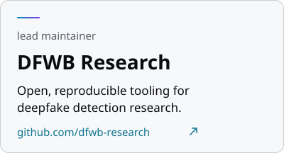</picture></a>
<a href="https://github.com/dynamis-group"><picture><source media="(prefers-color-scheme: dark)" srcset="assets/cards/dynamis-dark.svg">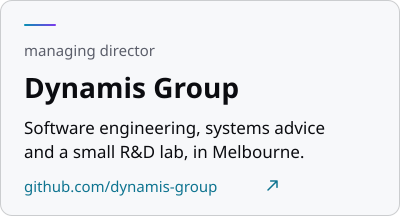</picture></a>
<!-- FEATURES:END -->

## Stack

<!-- STACK:START -->

<b>Research &amp; ML</b> 
<picture><source media="(prefers-color-scheme: dark)" srcset="assets/stack/python-dark.svg">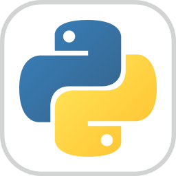</picture>
<picture><source media="(prefers-color-scheme: dark)" srcset="assets/stack/pytorch-dark.svg"></picture>
<picture><source media="(prefers-color-scheme: dark)" srcset="assets/stack/lightning-dark.svg"></picture>
<picture><source media="(prefers-color-scheme: dark)" srcset="assets/stack/huggingface-dark.svg"></picture>
<picture><source media="(prefers-color-scheme: dark)" srcset="assets/stack/timm-dark.svg">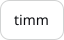</picture>
<picture><source media="(prefers-color-scheme: dark)" srcset="assets/stack/opencv-dark.svg">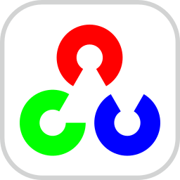</picture>
<picture><source media="(prefers-color-scheme: dark)" srcset="assets/stack/wandb-dark.svg"></picture>
<picture><source media="(prefers-color-scheme: dark)" srcset="assets/stack/jupyter-dark.svg"></picture>
<picture><source media="(prefers-color-scheme: dark)" srcset="assets/stack/latex-dark.svg">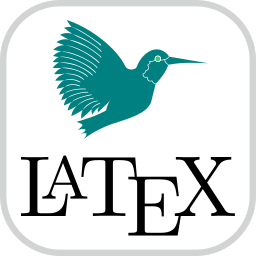</picture>

<b>Web &amp; edge</b> 
<picture><source media="(prefers-color-scheme: dark)" srcset="assets/stack/ts-dark.svg">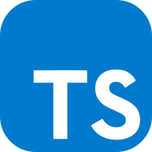</picture>
<picture><source media="(prefers-color-scheme: dark)" srcset="assets/stack/astro-dark.svg">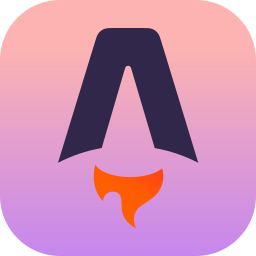</picture>
<picture><source media="(prefers-color-scheme: dark)" srcset="assets/stack/tailwind-dark.svg"></picture>
<picture><source media="(prefers-color-scheme: dark)" srcset="assets/stack/solidjs-dark.svg"></picture>
<picture><source media="(prefers-color-scheme: dark)" srcset="assets/stack/cloudflare-dark.svg"></picture>
<picture><source media="(prefers-color-scheme: dark)" srcset="assets/stack/workers-dark.svg"></picture>
<picture><source media="(prefers-color-scheme: dark)" srcset="assets/stack/vitest-dark.svg"></picture>
<picture><source media="(prefers-color-scheme: dark)" srcset="assets/stack/playwright-dark.svg"></picture>
<picture><source media="(prefers-color-scheme: dark)" srcset="assets/stack/stripe-dark.svg"></picture>

<b>Infra &amp; tooling</b> 
<picture><source media="(prefers-color-scheme: dark)" srcset="assets/stack/docker-dark.svg">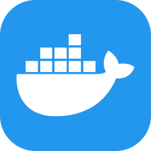</picture>
<picture><source media="(prefers-color-scheme: dark)" srcset="assets/stack/linux-dark.svg"></picture>
<picture><source media="(prefers-color-scheme: dark)" srcset="assets/stack/bash-dark.svg"></picture>
<picture><source media="(prefers-color-scheme: dark)" srcset="assets/stack/git-dark.svg">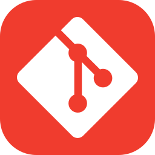</picture>
<picture><source media="(prefers-color-scheme: dark)" srcset="assets/stack/githubactions-dark.svg"></picture>
<picture><source media="(prefers-color-scheme: dark)" srcset="assets/stack/uv-dark.svg"></picture>
<picture><source media="(prefers-color-scheme: dark)" srcset="assets/stack/ruff-dark.svg"></picture>
<picture><source media="(prefers-color-scheme: dark)" srcset="assets/stack/pytest-dark.svg">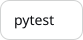</picture>
<picture><source media="(prefers-color-scheme: dark)" srcset="assets/stack/mypy-dark.svg">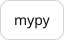</picture>

<!-- STACK:END -->

## Activity

<!-- ACTIVITY:START -->
<picture><source media="(prefers-color-scheme: dark)" srcset="assets/activity/skyline-dark.svg">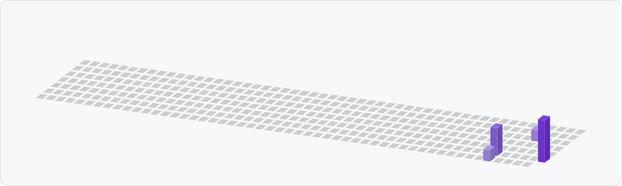</picture>

<picture><source media="(prefers-color-scheme: dark)" srcset="assets/activity/contributions-dark.svg">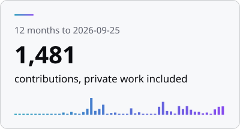</picture>
<picture><source media="(prefers-color-scheme: dark)" srcset="assets/activity/languages-dark.svg">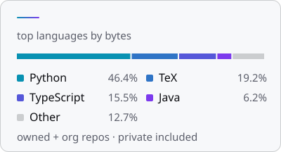</picture>

22 public contributions in the last 12 months. Top languages by bytes across my own repositories and dynamis-group's, private ones included, notebooks left out: Python 46.5%, TeX 19.1%, TypeScript 15.4%, Java 6.2%.
<!-- ACTIVITY:END -->

<samp>ORCID 0009-0002-7771-1081 · Australia · refreshed daily</samp>

